# Forno Italiano Pizzeria - Project 3

The link to live project can be found here - https://forno-italiano-pizzeria-ee821493ba58.herokuapp.com/

The link to github repository can be found here - https://github.com/declanwatts97/forno_italiano_pizzeria_project

### Introduction

Welcome to Forno Italiano Pizzeria! We are a small family run pizzeria located in the heart of Newcastle. Explore our site for information about our restaurant, view our vast award winning menu, and why not book a table to come visit us and see for yourself why we are considered the number 1 pizzeria in Newcastle.

## Table of Contents

- [Forno Italiano Pizzeria - Project 3](#forno-italiano-pizzeria-project-3)
      + [Introduction](#introduction)
   * [Table of Contents](#table-of-contents)
   * [User Experience](#user-experience)
      + [User Requirements](#user-requirements)
   * [User Stories](#user-stories)
      + [Website Visitors](#website-visitors)
      + [Acceptance Criteria](#acceptance-criteria)
      + [Goals of Site Developers](#goals-of-site-developers)
      + [Acceptance Criteria](#acceptance-criteria-1)
   * [Structure](#structure)
      + [Navbar](#navbar)
      + [Footer](#footer)
      + [Home Page](#home-page)
      + [Menu Page](#menu-page)
      + [Our Restaurant Page](#our-restaurant-page)
      + [Book Table Page](#book-table-page)
      + [Book Table Success Page](#book-table-success-page)
   * [Design](#design)
      + [Wireframes](#wireframes)
      + [Entity Relationship Diagram](#entity-relationship-diagram)
      + [Colour Scheme](#colour-scheme)
      + [Font](#font)
   * [Imagery](#imagery)
   * [Technologies Used](#technologies-used)
      + [Development Tools](#development-tools)
   * [Deployment](#deployment)
      + [Deployment to Heroku](#deployment-to-heroku)
      + [Deployment Procedure](#deployment-procedure)
   * [Testing](#testing)
      + [User Stories Testing](#user-stories-testing)
      + [Manual Testing](#manual-testing)
      + [Testing Summary](#testing-summary)
      + [Browser Compatibility](#browser-compatibility)
   * [Credits](#credits)
      + [Content and Inspiration](#content-and-inspiration)
      + [Acknowledgements ](#acknowledgements)
   * [Contact Information](#contact-information)

## User Experience

### User Requirements

The website has been created with the below goals in mind:

1. Accessability - The website needs to be as accessible as possible so all users can view the site as it was intended.

2. Device Friendly - The website needs to be able to be viewed on devices of all sizes, and on all browsers to ensure our full customer base can access all content.

3. Menu - The website needs to include our Menu, so that our customers can make an informed decision on whether or not they would like to book a table with us.

4. Table Booking - The website needs to include a table booking system so that customers can reserve a table on their chosen dates.

5. Admin access for database - The website needs to have access to the database so that the restaurant manager can view table bookings and arrange service.

## User Stories
### Website Visitors

1. As a user I require a clean single design, emphasising the main features of the website so I can access the information I need easily.

2. As a user I require easy clear navigation, so that I can make my way to which ever page is required for my visit. 

3. As a user I require the website to be responsive, so that I can access it on any device I may have. I require ease of access to book up at any time.

4. As a user I require a book table option, so I can reserve a table online and not have to call during busy hours.

5. As a user I require contact information for the restaurant, so I know the address for my visit and the phone number/email for any queries not answered by the website.

6. As a user I require an expansive menu with prices, so that I can decide if I want to visit, and plan my meal prior to arrival.

### Acceptance Criteria

1. The user should load into the page being clean, uncluttered using consistent typography and colour scheme. All main features should be visable and images load quickly.

2. The user should be able to view the navbar on all pages, with it visable at the top on desktop and as a hamburger menu on mobile and tablet. All navigation links should be clearly labeled and take you to the correct page on click.

3. When the user accesses the website with a tablet, phone or on desktop the layout should adapt with no horizontal scrolling. The book table button should be accessible and working from the navbar and homepage. All interactive elements should remain funtional across browsers. 

4. When the user is on the book table page, they should be prompted to fill in Full Name, Email, Phone Number, Date, Time and Party Size. A confirmation message should show up when submitted or an error if there is a double booking. The booking should be stored in the database. All required fields should be validated before submission.

5. When the user is on the our restaurant page, the full address, email, phone number and opening times should be clearly listed. The opening hours should be clearly listed by day.

6. When the user navigates to the menu section, the items should be grouped into main categories and each item has a price. Prices should be aligned directly to the right for easy scanning.

### Goals of Site Developers

1. As a developer I require clean code which follows the standard for readability. This ensures any changes can be easily made and the code understood by other contributors.

2. As a developer I require a database model relevant to the project and entity relationship diagram to outline the reason for the model.

3. As a developer I require the site to be responsive on all devices and browsers, allowing the customer base the best possible experience when viewing the site.

4. As a developer I require a detailed Readme document which outlines the planning, development and deployment procedure.

5. As a developer I require customers to be able to book tables, and if a double booking occurs that they are notified and the booking returns an error message.

### Acceptance Criteria

1. In the finished project, all HTML should follow semantic structure, all indentation is consistent, and the pages should pass through validation without error.

2. In the project repository, there should be a models.py file with the designed model for the database and also an entity relationship diagram shown in the readme.

3. When the site is deployed and tested on Mobile, Tablet and Desktop then no layout breaks should occur, and all content should resize nicely to fit chosen device.

4. If a new contributor clones the repository and opens the readme, they should have a full description of the purpose of the project, design choices made and the deployment procedure.

5. If a table is already booked for a specific date or time and a second user tries to book, the system should check availability in real time and return an eror message if double booked.

## Structure

The site has 5 active pages:
- A home landing page
- An our restaurants page so customers can view our contact information
- A menu page, so customers can view our menu online with prices.
- A table booking page, so customers can book a table online.
- A table booking success page, so customers are made aware that their booking has been accepted.

### Navbar

The navbar contains the pizzeria logo, name, and 4 active links. These links are to the menu, our restaurant page, book table page, and back to home. The navbar switches to a hamburger icon o  smaller screen sizes.

### Footer

The footer has 3 social media links and contact information for the business. The social media links take you to the relevant social media and clicking on the contact information on mobile prompts you to call/email and the address takes you to view on a map.

### Home Page

The home page is kept simple with a hero image displaying some of the restaurants pizza, with a book table option centre of the screen to enable customers to easily be able to get straight on with booking a table.

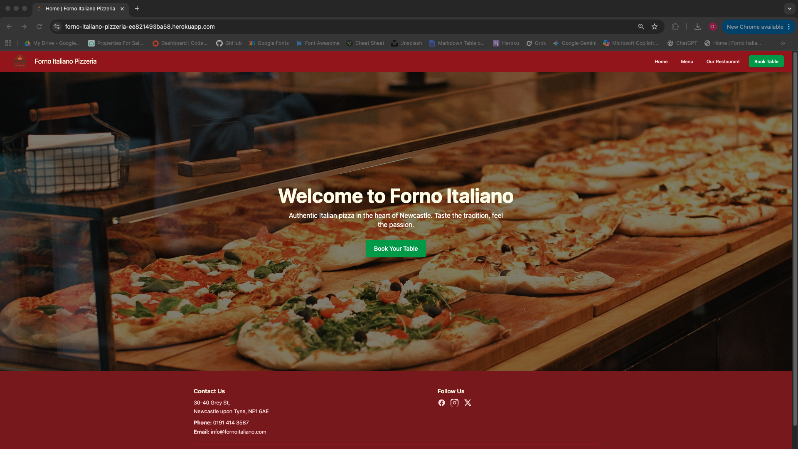

### Menu Page

The menu page is split into 4 sections for appetizers, pizzas, desserts and drinks. The menu items are laid out with the prices aligned to the right.

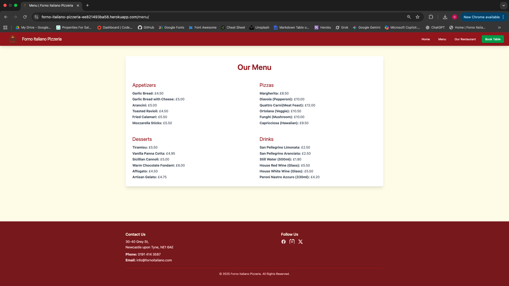

### Our Restaurant Page

The our restaurants page gives the customer all of the restaurants info. The contact information of email and phone number along with the address and the opening hours. There is also a picture of the inside of the restaurant.

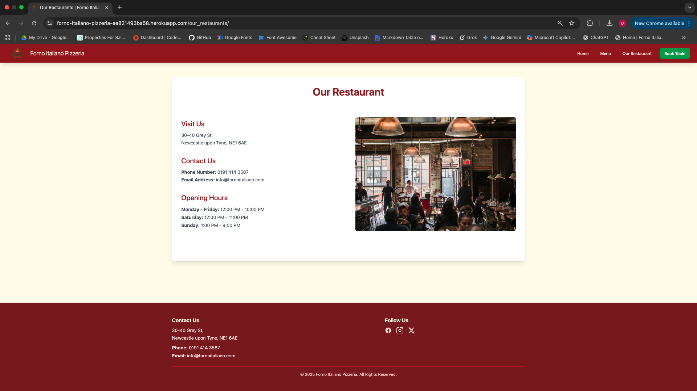

### Book Table Page

The book table page contains all the relevant information for a customer to reserve a table. This is displayed in a form to be filled in with a submit button once complete.

### Book Table Success Page

The table booking success page returns a message thanking the customer for booking and that we look forward to seeing them. Theres a return to home button to take them back to the home page.

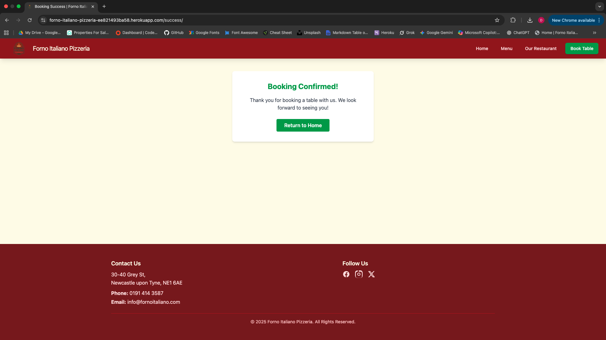

## Design

### Wireframes

The below wireframes were created at the beginning of the design process, these were to be the layout followed for the creation of the site:

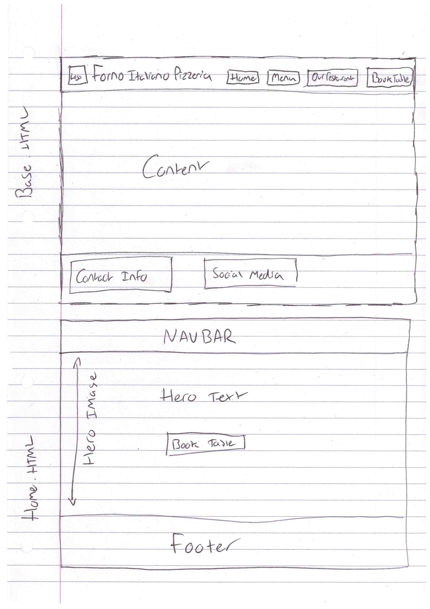

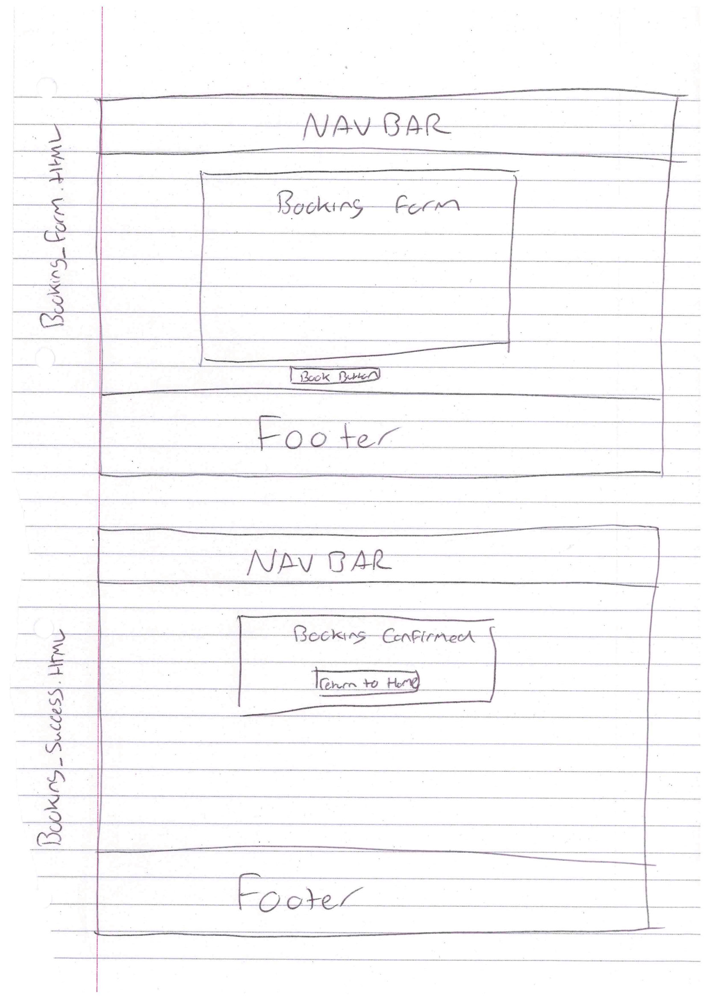

### Entity Relationship Diagram

The entity relationship diagram for this project is a single entity, meaning there are no one to many or many to many relationships. This entity stands alone.

This shows the chosen model behind the database for the table booking system which has been put in place for the website.

### Colour Scheme

 - The main colour scheme was red for the header and footer, and a light yellow colour for the background of the pages.
 - On multiple web pages theres an additonal white background which sits on top of the yellow background.
 - The button colours on this website are Green.
 - The heading colours on each page are the same red as the header and footer.

### Font

- The font used in this project are just the standard global font for HTML pages.

## Imagery

All images used on this project were taken from unsplash.

Unsplash was used for the hero image, as well as the image on the our restaurant page.

Gemini AI was used to create the business logo.

## Technologies Used

### Development Tools

- Github: For hosting code through repositories and deployment.
- Heroku: For hosting and deploying the final site.
- VS Code: Used for writing and testing local code prior to sending to github.
- HTML5: The standard language of a web page.
- CSS3: For styling the website.
- Javascript - For creating the interactive trivia quiz.
- Python - Used through the Django framework for the models, views, url's of the site.
- Django - the django framework was used for the building of this site.
- Taiwind: To create responsive design and also page styling through the use of classes.
- Favicon.io: For adding the favicon on the title bar of webpage.
- Gemini AI - for troubleshooting as well as producing logos and ideas for the menu.
- PostgreSQL - for hosting the site database.

## Deployment

### Deployment to Heroku

This site has been deployed to Heroku. To view, please see below:

1. View the GitHub repository. This project is found at title (https://github.com/declanwatts97/forno_italiano_pizzeria_project)
2. You can view the deployment on Heroku by visiting https://forno-italiano-pizzeria-ee821493ba58.herokuapp.com/

### Deployment Procedure

See below step by step instructions for how to deploy to Heroku:

1. Create a new app on Heroku with a unique name.
2. Click on the settings tab and reveal the config vars. Add a key of DISABLE_COLLECTSTATIC and add a value of 1.
3. Install a production ready web server to your project with pip3 install gunicorn~=20.1.
4. Add your web server to requirements.txt with pip3 freeze --local > requirements.txt
5. Create a file named Procfile at the root directory of the project.
6. In the Procfile add web: gunicorn my_project.wsgi.
7. In your settings.py file add '.herokuapp.com' to your allowed hosts list.
8. Return to heroku and click on the deploy tab.
9. Connect and log in to github after clicking the connect to github box.
10. Scroll to the bottom of the page and manually deploy your site on the main branch.
11. Open the resources tab and choose an Eco Dyno.
12. Click open app to view your deployed project!

## Testing

### User Stories Testing

1. As a user I require a clean simple design, I tested this by getting a friend to check over and ensure that all required information was easily available and the design was easy to follow.

2. As a user I require easy clear navigation, I tested this by getting a friend to navigate around the site as a consumer and ensure it was simple.

3. As a user I require the website to be responsive. This was tested on Google dev tools to ensure all screen sizes were responsive. This was also tested on my phone, iPad and desktop computer to ensure the deployed version matches the local version

4. As a user I require the option to book a table. I tested this by acting as the consumer, walking through the process of booking a table and ensuring that I got the booking success response. I also tested that this pulled through to the admin panel for the site owner to see.

5. As a user I require contact information for the restaurant. I tested this by checking the deployed version contained the correct information and that they can be directly accessed through mobile with a link to call or email, and an address which links to maps.

6. As a user I require an expansive menu with prices. This was tested by getting a friend to review the menu to check they think it contains valid items, and also checked through AI that the prices are valid for the items.

7. As a developer I require clean code which follows the standard for readability. This was tested by running the code through various validators (results shown further below).

8. As a developer I require a database model relevant to the project. This was tested by completing the booking form and checking in the admin panel that all the required information is stored.

9. As a developer I require the site to be responsive across all devices. This was tested as mentioned above in the user story.

10. As a developer I require a readme document which outlines the planning, development and deployment procedure. I tested this by asking a friend to read through and check they can follow the life cycle of this project.

11. As a developer I require customers to be able to book tables, an error message show if a double book in occurs. This was tested by purposely double booking through the deployed site and ensuring that it is rejected from being sent to the database with the message being returned.

### Manual Testing

1. Navigation - I tested the navigation by clicking the navbar links and ensuring that they redirected me to the correct webpages. I tested this on multiple devices. This worked as expected.

2. Footer - I tested the footer by clicking each social media icon to ensure that these redirected me to the correct social media site. As the pizzeria doesn’t have socials yet this just directed me to the social media companies home page. I also tested the contact info which redirects mobile users to the valid form of contact (email/phone) and maps for the address. This worked as expected.

3. Webpage responsiveness - each webpage was tested across multiple screen sizes, to ensure that everything works as it should. I tested this mainly through chromes developer tools as well as my laptop and mobile phone. I have shown some screenshots below from the chrome developer tools for all web pages:

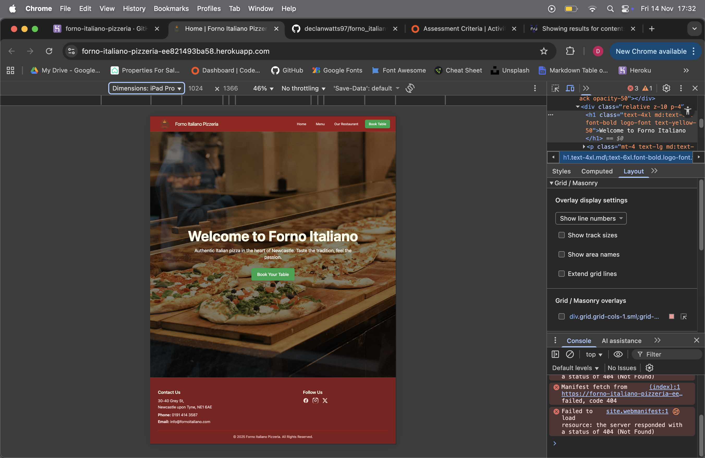

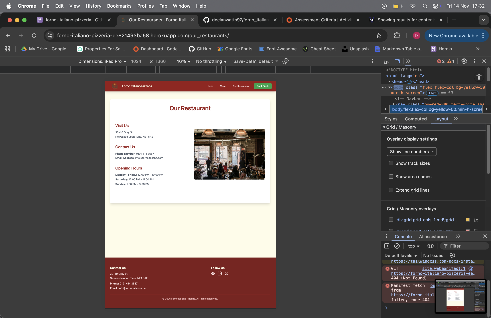

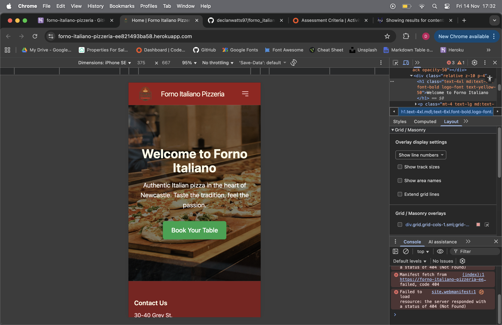

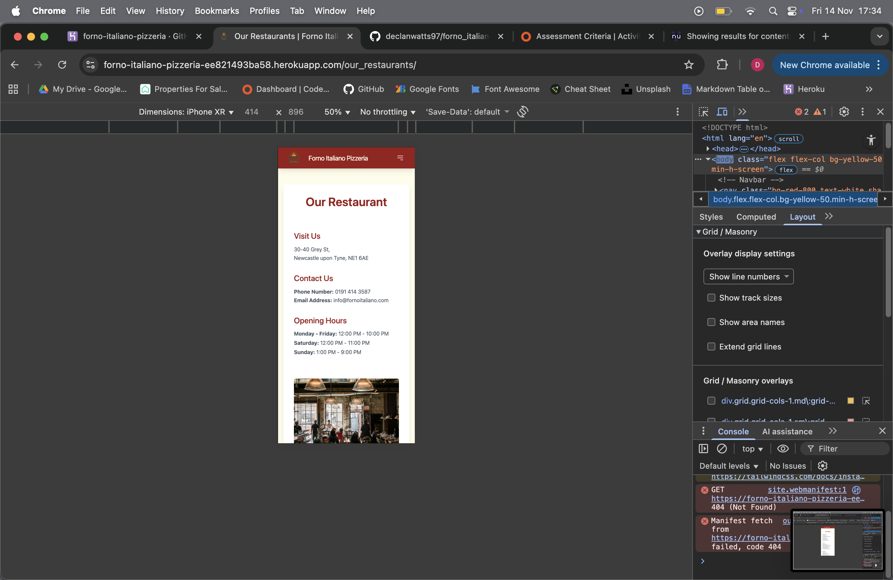

4. Table booking - the table booking function was tested in 3 main ways:

- Through filling in the information on the form and submitting, ensuring that the information was accepted and returned the success page.

- Ensuring that this successful booking was sent through to the admin panel, with the booking and all information submitted showing to the site owner.

- Purposely double booking and ensuring that the error message is returned to prevent a double booking.

Screenshots for these points are below:

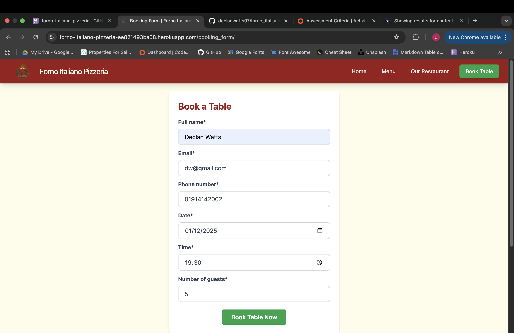
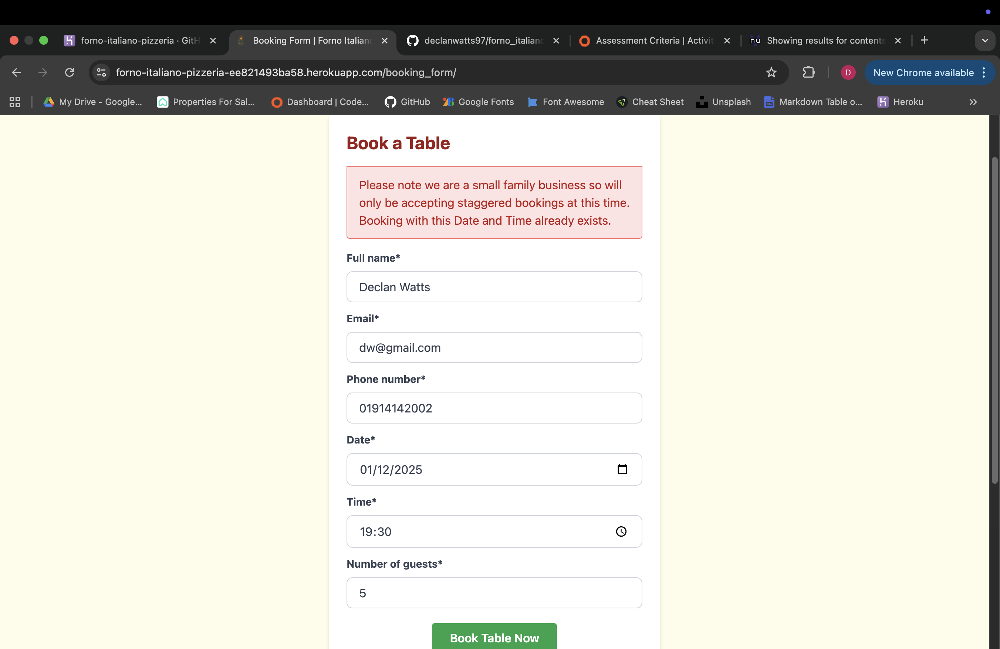

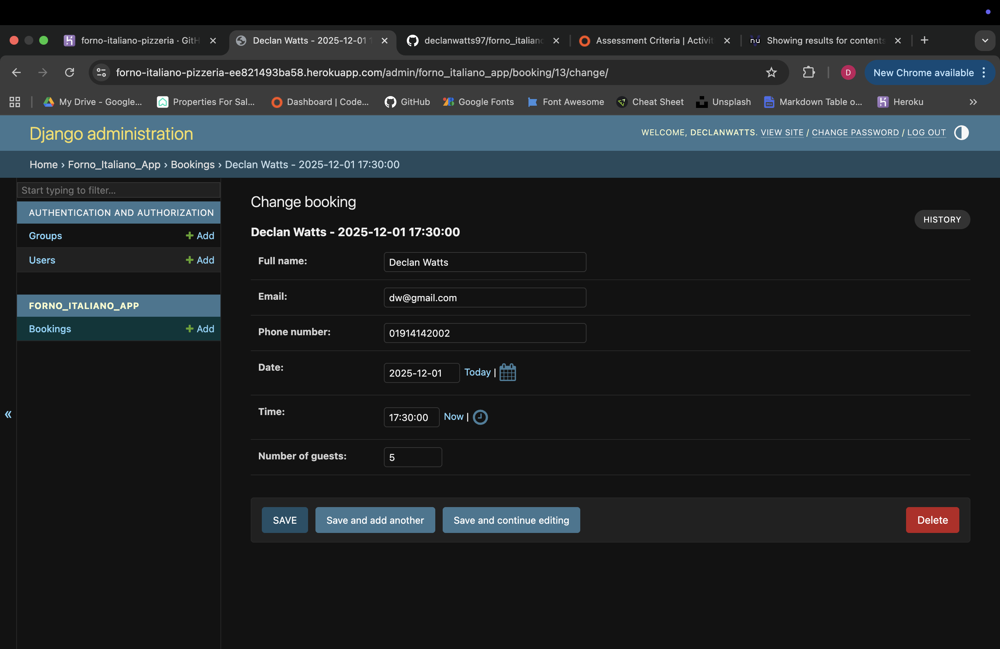

5. HTML Validation - I ran my html code through the W3C validator service and have provided screenshots below. The only remaining errors are as a result of Django's blocks and templates:

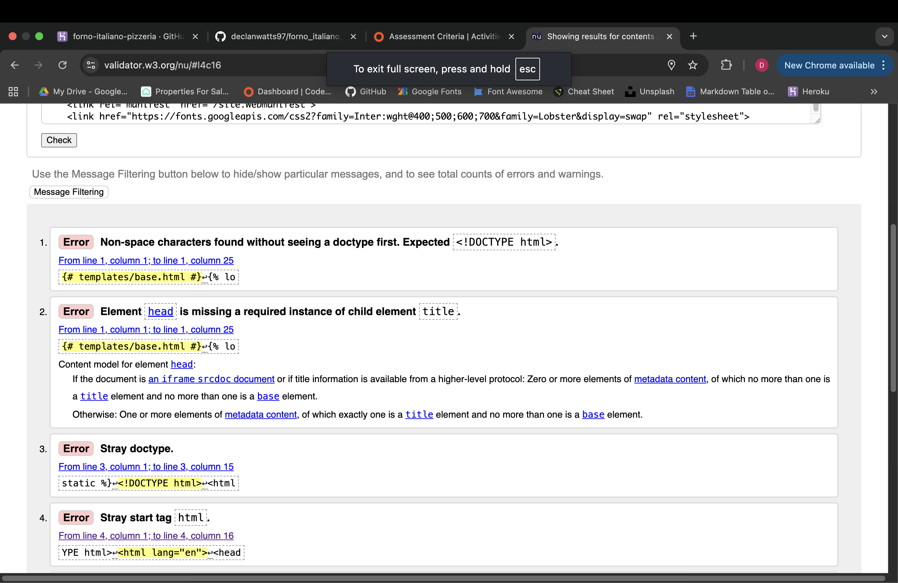

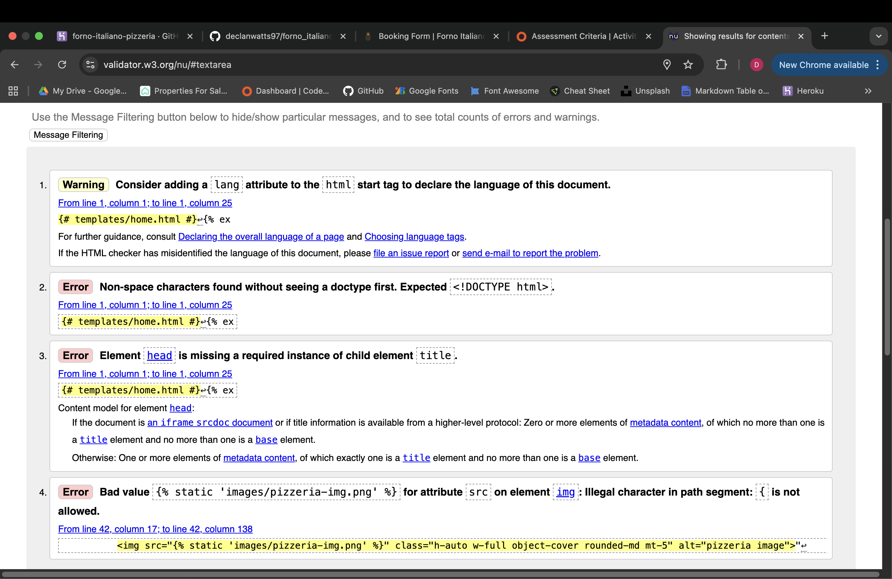

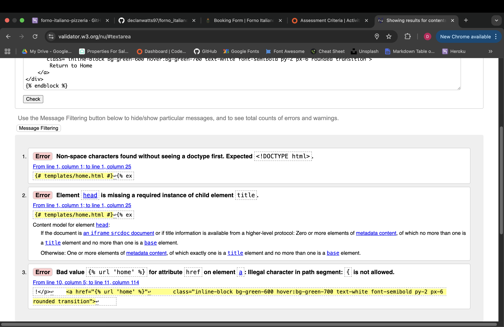

6. CSS validation - I ran my css code through the W3C validator service and have provided screenshots below. My code passed through the validator with no errors.

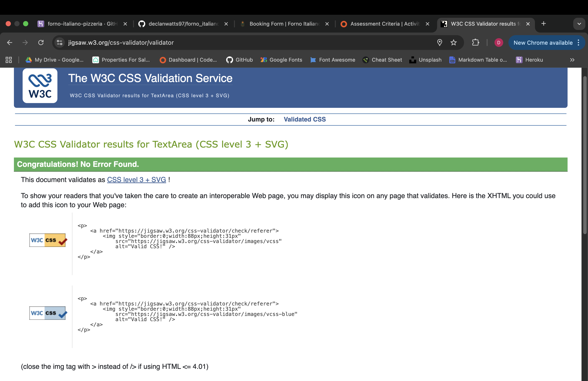

7. JavaScript Validation - I ran my JavaScript code through JS lint and have provided screenshots below. MY code passed through with no major errors on the validator.

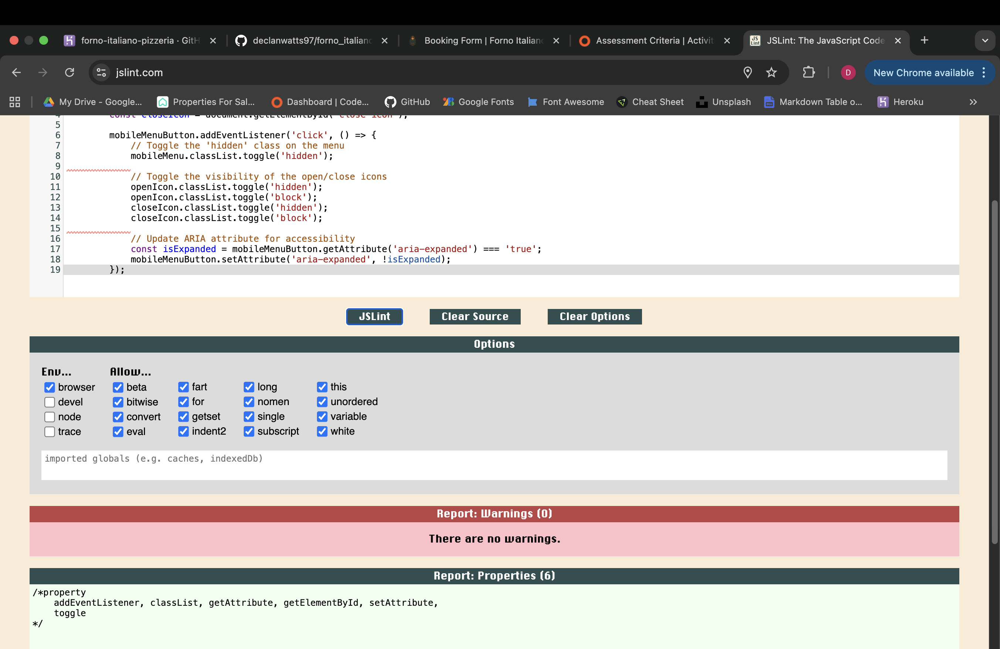

8. Dev Tools - I checked my code through the console on chrome dev tools. One area to improve in the future is the that tailwind CCS needs to amended to a post CSS plugin or use the tailwind CLI for production. This will be fixed in future updates.

### Testing Summary

As shown in the breakdown of testing above, the website meets all user and developer goals as well as being fully responsive. This is fully operational from a design and production viewpoint. Manual testing was the primary form of testing used in this project. Automated testing will be implemented in the future.

### Browser Compatibility

This website was tested on the below browsers to ensure compatibility:

- Safari
- Google Chrome
- Microsoft Edge
- Firefox

## Credits
### Content and Inspiration

- Images: images taken from Unsplash free as uploaded by other users.
- Content: content inspired by Gemini AI for Menu and Logo.

### Acknowledgements 

- Tailwind: for most of the styling used on the website.
- Code Institute: for ideas, assistance and the LMS, which was referred back to while designing this project.
- Favicon.io - for the favicon used in browser title.
- Unsplash - for all images used on the webpage.
- Gemini AI - for the logo and some menu ideas, as well as occasional assistance troubleshooting.

## Contact Information
- For any queries or feedback, please contact declan.watts97@gmail.com

